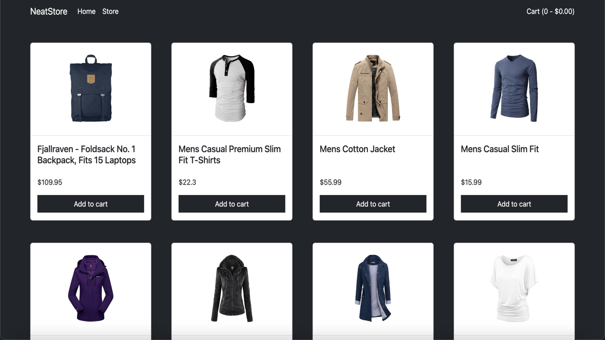
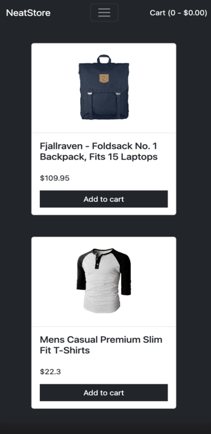

	<h1>Neat Shopping
	 
		
        
		
		
		
		 
	</h1>
	<h3><b><a href="https://hzk2021.github.io/cv-creator">View Live Demo</a></b></h3>

## Description

A simple frontend-only clothing store with a shopping cart. Data is retrieved directly from the Fake Store API, and styled using the Bootstrap CSS Library.

## Built Using

- JavaScript 
- React 
- Tailwind 
- Webpack 
- Babel 

## Preview

#### Desktop

#### Mobile

